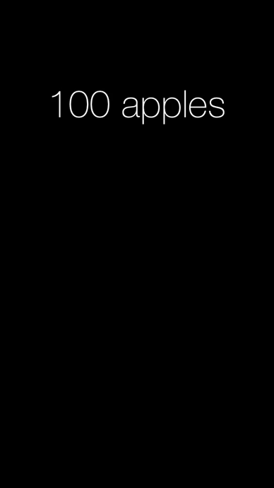

animated-ui-label
=================

Animation makes it easier to understand changes that happen to data. When showing data as text
there is no general way to animate changes and things like cross-fade are not very helpful.

Sometimes text conveys data such as amounts, speed, weight that can be animated in a meaningful
way by interpolating between these amounts, speeds or weights.

This UILabel subclass tries to help in these circumstances by splitting text text into a leading
number and a trailer, such that a text

    "100 apples" 
is really 100.0 and " apples" and if we need to change the text into  

    "400 apples"
then we are really animating between 100.0 and 400.0 with a shared trailing text " apples".

If these assumptions are not met, the text will be changed without animation.

You just need the AnimatedLabel.h/m and everything else is for testing purposes. Try something
like this

    [UIView animateWithDuration:0.4 animations:^{
       self.animatedLabel.text = @"400 apples";
    }];

AnimatedLabel will determine the duration and kind of animation from the regular UIView animations, 
such that you can animate along with other things and even do spring-animations. 
This is implemented by changing a internal view and then looking at the corresponding property on 
the presentation-layer to figure out where in the animation we are from start (0) to end (1). 
This work is done on the run-loop and keeps going when animation position has not changed for a while,
which is not necesarily when we reach 1. 

AnimatedLabel is made to allow other kinds of text interpolations. You override

    -(id)animationContextFrom:(NSString*)sourceText to:(NSString*)targetText;
to make the logic that determines whether animation is possible at all and to
perform any precalculations that would be used when calculating the interpolated
text (which will be done many times). You return nil when there should be no animation
and otherwise any object that suits you.

To calculate the actual text you override

    -(NSString*)textAtRatio:(CGFloat)ratio context:(id)context
                      from:(NSString*)sourceText to:(NSString*)targetText;
where ratio starts at 0.0 and ends at 1.0 but might reach outside this interval during spring animations.

The inner workings that allows making changes that follow UIView animations can be found as a UIView extension
in AnimView and can be used to make other kinds of UIView drivens animations on non-animatable properties.
As a simple example one could animate how text changes from empty to non-empty by adding one character 
at a time with something like:
    [label change:^(CGFloat ratio) {
       label.text = [text substringToIndex:(int)(ratio * text.length)];
    }];
